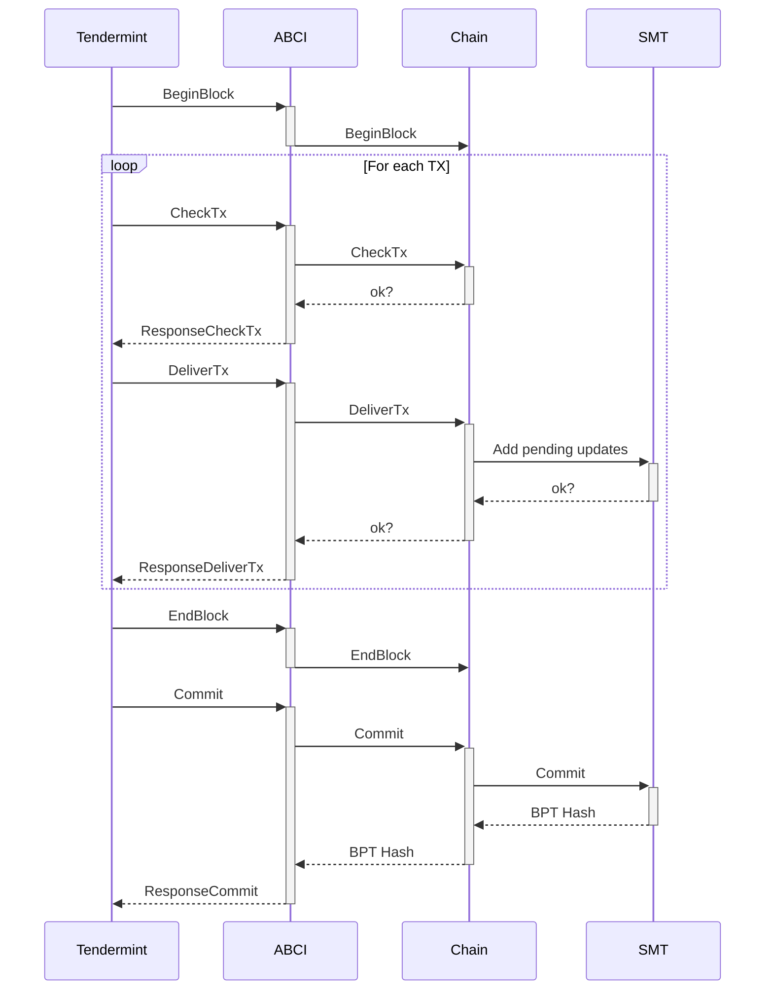
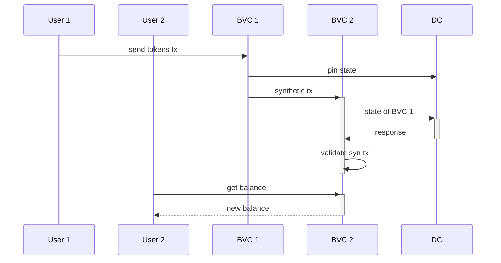

# Data Flow

## ABCI, Chains, and State

1. Tendermint notifies the ABCI application of the new block, the app notifies the chain
2. For each transaction in the block:
   1. Tendermint asks the app to check the TX, the app asks the chain, the chain validates the TX against the state
   2. Tendermint asks the ABCI to deliver the TX, the app asks the chain, the chain updates the state as necessary
3. Tenderment notifies the app of block end, the app notifies the chain
4. Tendermint tells the app to commit, the app tells the chain, the chain commits the state
5. The latest BPT root hash is returned from the state to the chain to the app to Tendermint

## Transaction between BVCs

1. User 1 submits a transaction, and it is relayed to the correct block validator chain (BVC 1)
2. BVC 1 processes the transaction
3. Concurrently
   - BVC 1 pins the hash of its updated state to the directory chain (DC)
   - BVC 1 produces a synthetic transaction and submits it to the recipient's BVC (2)
3. The DC adds the BVC's state hash to its chain, pinning it
4. BVC 2 fetches BVC 1's pinned hash from the DC to validate the synthetic transaction
5. BVC 2 processes the synthetic transaction
6. User 2, the recipient, can now query their account balance and see the transfered tokens

