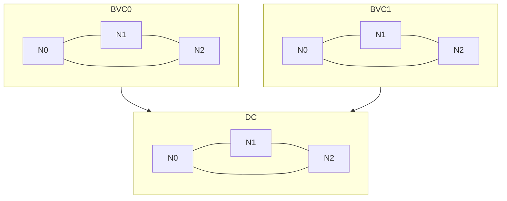

# Core Network Architecture

Each BVC exists as an independent Tendermint network, and the DC is a separate,
independent Tendermint network. Each node of a given network should exist on a
separate instance (as in a VM or docker container). The nodes of a given
Tendermint network must be able to communicate with each other via Tendermint's
peer-to-peer layer. Additionally, each node provides an RPC interface
which clients use to submit transactions and query the state of the chain.

